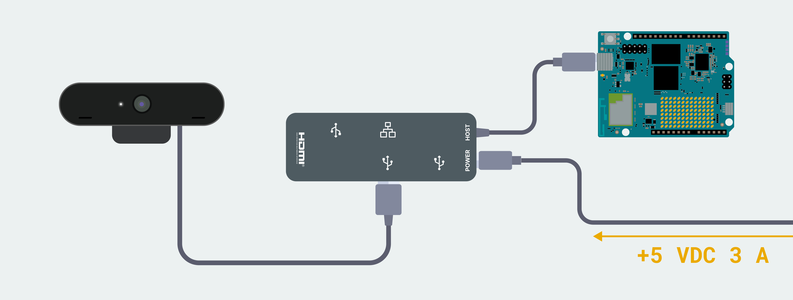

# Bloom — an offline field journal

**Bloom** turns an Arduino® UNO Q into a self-powered, offline field-journal cyberdeck: point it at a plant, an animal, or anything worth noticing on a hike, capture a photo, sketch on top of it, and talk through what you're observing with a fully local AI model. Every entry — photo, sketch, and note — is saved to the board itself and stays there unless you deliberately choose to sync it to a companion website. No connectivity is required to use it in the field.

Built for the [Invent the Future with Arduino UNO Q and App Lab](https://www.hackster.io/contests/invent-the-future-with-arduino-uno-q-and-app-lab) contest, Best Social Impact category — the pitch is a countermeasure to phone-and-camera culture: a single-purpose device that makes you stop, point, and wait for a note instead of snapping and swiping past.



## Bricks Used

- `web_ui`: hosts the on-board web interface (Capture / Sketch / Chat / Notes tabs) over HTTP, viewable on a small HDMI/LCD touchscreen with no internet needed.
- `llm`: runs a small local language model (`Qwen3.5-0.8B`) entirely on-device for the Chat tab — no cloud API calls for the core capture/note loop.
- `audio_classification`: identifies birdsong from a USB microphone using a custom-trained model, [Bird Calls](https://studio.edgeimpulse.com/studio/1062343) (16kHz audio, MFCC features, eight species classes — American Crow, American Pipit, American Robin, Mourning Dove, Red-tailed Hawk, Rock Pigeon, Blue Jay, Northern Cardinal — plus a background-noise class used to reject non-bird sound).

## Hardware and Software Requirements

### Hardware

- [Arduino® UNO Q](https://store.arduino.cc/products/uno-q)
- USB camera (x1)
- USB microphone (x1), for birdsong identification
- Small HDMI/LCD touchscreen
- Mini Bluetooth keyboard (for typing notes and chat messages)
- Power bank (USB-C PD passthrough)
- An enclosure — this build uses a repurposed train-case makeup bag, not a new plastic case

### Software

- Arduino App Lab

## How to Use the App

1. Connect the USB camera and the HDMI/LCD screen to the UNO Q.
2. Launch the App from App Lab. Wait until it starts.
3. Open a browser to `<UNO-Q-IP-ADDRESS>:7000` (or view it directly on the attached HDMI screen).
4. **Capture tab** — optionally note the Locality, Weather, and Habitat for this outing (these persist across captures, since conditions rarely change entry-to-entry), then point the camera at what you're observing and press "c" or tap Capture. This starts a new journal entry, assigned its own catalog number (e.g. `BLM-0007`).
5. **Sketch tab** — the captured photo and a blank sketch canvas appear side by side; draw directly on the canvas (touchscreen, mouse, or stylus) and tap Save Sketch.
6. **Chat tab** — tap 🎤 Listen to identify birdsong from the USB microphone (5-second clip, classified on-device), or describe what you're seeing/ask the local model a question about it; either result can be added straight into the entry's field note with one tap.
7. **Notes tab** — browse every saved entry (catalog number, photo thumbnail, locality, and note snippet, dated `MMM/DD/YYYY`), tap one to see the full photo/sketch/note plus locality/weather/habitat, edit any of it by hand, delete the entry, or sync it to a companion web app.

## Following the Grinnell Method

Bloom's data model borrows structure from the [Grinnell Method](https://mvz.berkeley.edu/history/the-grinnell-method/), the field-documentation standard Joseph Grinnell developed at UC Berkeley's Museum of Vertebrate Zoology: every observation gets a catalog number, and is recorded alongside where, when, and under what conditions it was made — not just a photo and a free-text note. Concretely, each entry stores:

- **Catalog number** (`BLM-0007`) — a stable accession-style ID derived from the entry's row in the database, shown on every entry the way a specimen tag would be.
- **Locality** — a plain-language description of where the observation was made (Grinnell's method paired this with an annotated topographic map; Bloom keeps it to a text field, since there's no GPS Brick in this build).
- **Weather** and **Habitat** — the abiotic and vegetation/environmental context Grinnell insisted on recording alongside every specimen, since (in his words) "you can't tell in advance which observations will prove valuable."

This is deliberately the lightweight version of Grinnell's four-part system (field notebook, field journal, species accounts, specimen catalog) rather than a full re-implementation — Bloom's single `entries` table covers the field notebook and journal roles, cross-referenced by catalog number and timestamp, sized to fit a one-outing capture-and-annotate loop on a 5" touchscreen rather than a museum's permanent research collection.

## How It Works

### 🔧 Backend (`python/main.py`)

- **Camera & live preview** — `preview_loop()` runs continuously in a background thread, pushing a downscaled JPEG preview to the browser over the socket at `PREVIEW_FPS`. A capture doesn't reuse this cached frame; it grabs one directly from the camera under `_camera_io_lock` so it can't collide with the preview loop's own reads.
- **Local storage** — every entry (timestamp, photo, sketch, note) is one row in a small SQLite database on the board's own storage (`python/journal/journal.db`). No server, no cloud database.
- **Local LLM chat** — `LargeLanguageModel` (the `llm` Brick) runs a system-prompted "field naturalist assistant" persona and streams responses back token-by-token via `chat_stream()`.
- **Notes CRUD** — `list_entries` / `get_entry` return summaries and full detail for the Notes tab; `update_note` and `delete_entry` handle hand-editing and deleting a saved entry.
- **Cloud sync** — `sync_entry()` is a deliberate, per-entry action (never automatic) that POSTs an entry's photo/sketch/note as JSON to a companion site at `field-notes.netlify.app`. If there's no connection, the entry stays saved locally and the UI reports the failure rather than pretending it worked.

```python
ui = WebUI()
field_llm = LargeLanguageModel(system_prompt="You are a knowledgeable field naturalist assistant...")

def handle_capture_message(sid, data=None):
    threading.Thread(target=capture_photo, daemon=True).start()

ui.on_message("capture", handle_capture_message)
```

### 💻 Frontend (`assets/index.html` + `assets/app.js`)

The interface is a four-tab layout (Capture / Sketch / Chat / Notes) sized for a small touchscreen, one tab visible at a time:

- The **sketch canvas** only gets its real pixel dimensions once its tab is actually visible — a `<canvas>` inside a hidden panel measures 0×0, so `switchTab('sketch')` re-measures it on the next animation frame right after the panel is shown.
- The **Chat tab** streams model responses into chat bubbles as they arrive, each with a "+ Add to Note" button that appends the response into the entry's field note.
- The **Notes tab** fetches the entry list from the board on demand (`list_entries`), and lazily loads full detail (`get_entry`) only for the entry you tap — full-resolution photos aren't sent for every row, just a small thumbnail.

```javascript
const ui = new WebUI();

ui.on_message('photo_saved', message => {
  currentEntryId = message.id;
  switchTab('sketch'); // natural next step after a capture
});

ui.on_message('llm_response_chunk', chunk => {
  activeAiBubble.rawText += chunk;
  activeAiBubble.textEl.textContent = activeAiBubble.rawText;
});
```

## Design Notes for Judging

- **Offline-first, cloud-optional**: everything works with zero connectivity; syncing to the companion web app is a separate, deliberate action, never automatic.
- **Data sovereignty**: nothing leaves the board unless you choose it to, by design — relevant for citizen scientists and land stewards who may not want their observation data on a corporate server by default.
- **Repurposed enclosure**: the train-case housing is reused, not manufactured new, for this build.